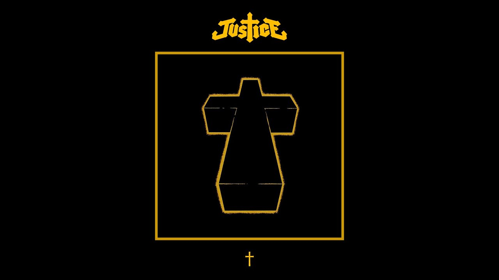
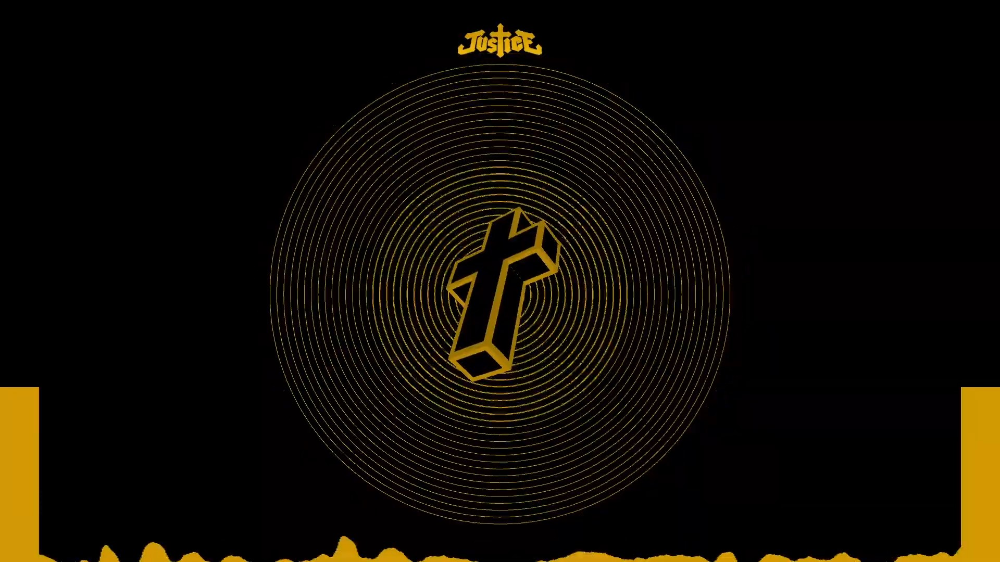
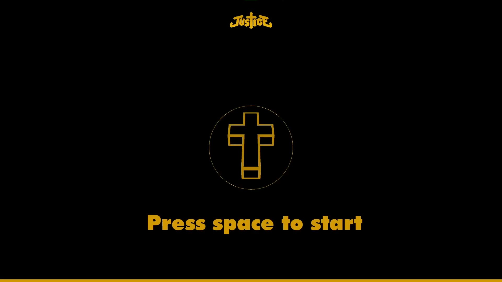
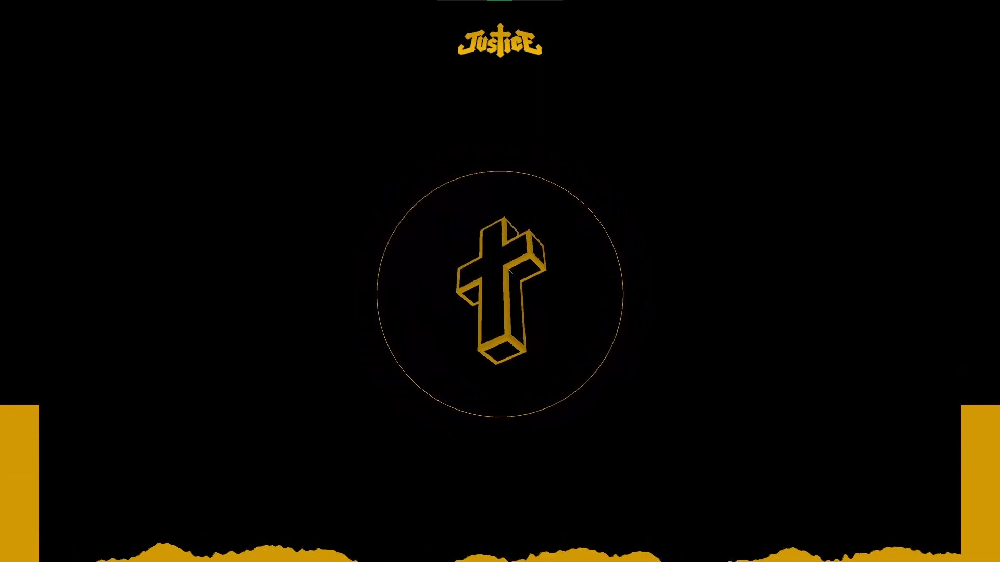
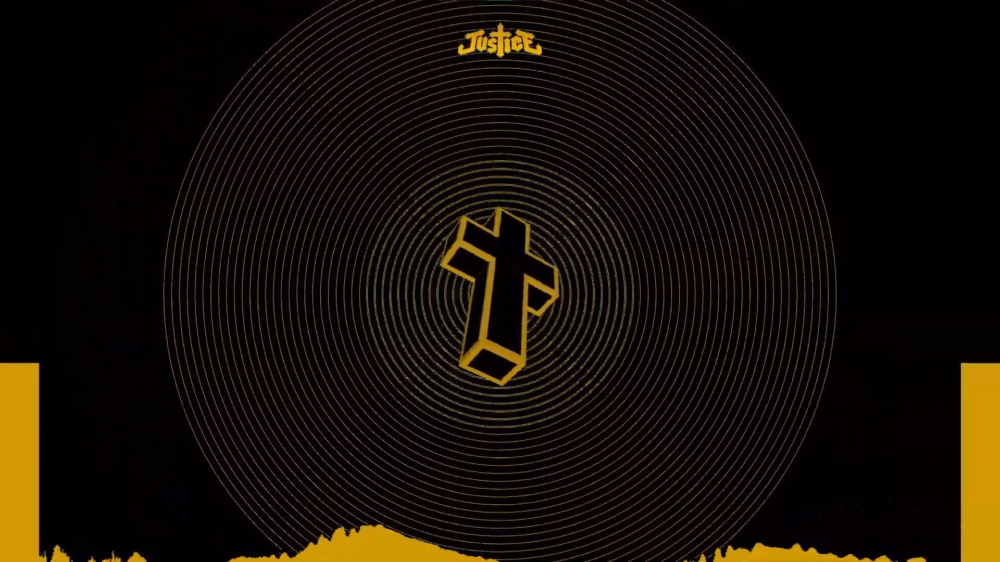
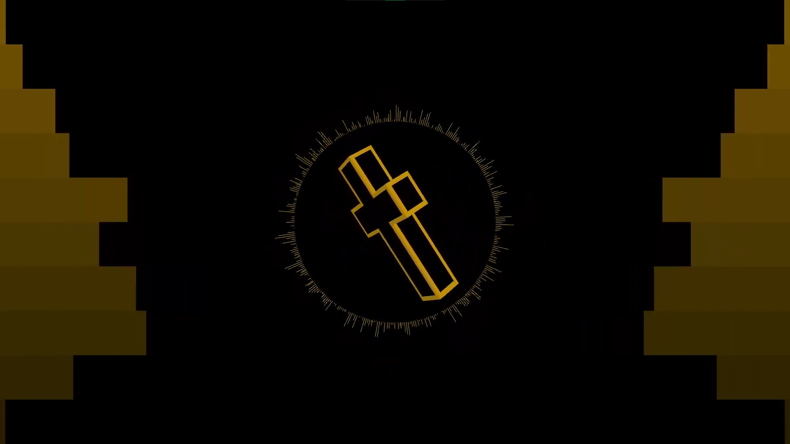

# Music Visualiser Project

| Name | Student ID |
|-----------|-----------|
| Ben Corran | C21430484 |
| Caoimhin Condon | C21496054 |  
| Evan Li | C21414026 | 

# Description 
This is a visualization of the song Gensis by the band Justice. 
It was inspired by the album art associated with the song and the color pallete was chosen to match.

The original

Our visualization

# Video
[Justice - Genesis](https://www.youtube.com/watch?v=a6ICxJysCqQ)

# Screenshots
Title screen 

Phase one

Phase one buildup

Phase two

# Instructions
Press the spacebar to start/restart the visualization.
The left and right arrow keys can be pressed to change the direction of the crosses rotation 
(this can sometimes make the transition between phases 1 and 2 less perfect)

# List of classes/assets
| Class/Asset | Source |
|-----------|-----------|
| TeamVisual.java | Modified from original "MyVisual.java" |
| AudioBandsVisual.java | Modified from original "AudioBandsVisual.java |
| CircularWaveVisual.java | Self written |
| CrossVisual.java | Self written |
| TrumpetBandVisual | Self written (Borrows some code from Audiobands) |
| WaveForm.java | Modified from original "WaveForm.java" |
| cross.obj | Self made |
| innerCross.ob | Self made |
| Futura.ttf | Sourced online |
| Genesis.mp3 | Downloaded from YouTube |
| Justice.png | Modified screnshot from album cover |

# Team member input 
This project was completed with collaboration from all team members. The majority of development was done together, in person on the same computer, hence the majority of commits coming from a single account. 

### Ben
I chose the song took care of modelling the cross and wrote the CrossVisual and TrumpetBandVisual classes. 
I am most proud of the 3D representation of the cross and having it sync up correctly with the beat. 
I learned the basics of 3D modeling in blender and how to work with audacity. 

### Caoimhin
I wrote the majority of the AudioBandsVisual and WaveForm classes.
I am most proud of phase 2 of the visualisation.
I learned about frequency bands and how to use them to syncronise visuals to music. 

### Evan
I wrote the CircularWaveVisual, craeted the piano buildup visualization near the end and collaborated with the rest. 
I am most proud of the piano buildup visualisation.
I learned how to use sin waves to create a circular waveform. 

